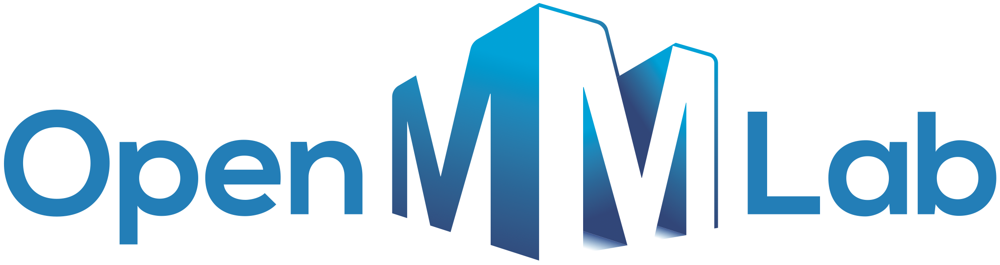

# Attention‑based Feature Fusion Network

This repository is built on top of the LiDAR‑based 3D object detection framework **OpenPCDet**.
It modifies the original architecture to support **attention‑based feature fusion** for
multi‑modal / multi‑feature inputs and integrates a YOLOv5‑based image module for research.


## 1. Overview

- Base framework: OpenPCDet (LiDAR 3D Object Detection)
- Main modifications
	- Extend / modify `pcdet/models` and `pcdet/datasets` to add
		**attention‑based feature fusion modules**
	- Integrate with a **YOLOv5 2D detector** via the `tools/` and `yolov5/` directories
	- Provide templates and preprocessing scripts for custom datasets
- Supported datasets
	- KITTI, NuScenes, Waymo, Lyft, ONCE, Pandaset (inherited from OpenPCDet)
	- Custom datasets (see docs/CUSTOM_DATASET_TUTORIAL.md)

This codebase keeps the **OpenPCDet v0.5** training/evaluation pipeline
while allowing you to experiment with additional attention‑based fusion structures.

---

## 2. Directory Structure

The main directories at the project root are:

- `pcdet/`
	- Core library that contains **model definitions, dataset definitions,
		data augmentation, post‑processing**, etc.
	- `datasets/`: loaders for KITTI, NuScenes, Waymo, Lyft, ONCE, Pandaset and custom datasets
	- `models/`: 3D backbones, necks, heads, detectors, ROI heads and fusion modules
	- `ops/`: C++/CUDA extensions such as spconv‑based ops, ROI pooling, PointNet++
- `tools/`
	- Scripts and config files used to run experiments.
	- `train.py`: single‑GPU training script
	- `test.py`: evaluation script for trained models
	- `demo.py`: visualization demo for a single point cloud (see docs/DEMO.md)
	- `cfgs/`: YAML config files for each dataset / model combination
	- `process_tools/`: preprocessing utilities (e.g., database generation)
- `yolov5/`
	- Contains the original YOLOv5 code, used as a 2D detector
		to enable **feature / box‑level fusion** with the 3D detector.
- `docs/`
	- `INSTALL.md`: installation and compilation guide
	- `GETTING_STARTED.md`: dataset preparation and basic train/eval usage
	- `DEMO.md`: demo and visualization guide
	- `CUSTOM_DATASET_TUTORIAL.md`: how to plug in a custom dataset
- `result*.txt`
	- Text logs summarizing experiment results or benchmark scores.

---

## 3. Installation

For full details, please refer to [docs/INSTALL.md](docs/INSTALL.md).

### 3.1 Requirements

- OS: Linux / macOS (Linux is the most thoroughly tested)
- Python: 3.6+
- PyTorch: 1.1+ (1.3–1.10 recommended)
- CUDA: 9.0+ (match the version to your PyTorch install)
- spconv: choose one of v1.0, v1.2, or v2.x (ensure config compatibility)

### 3.2 Quick Setup

1. Clone the repository
	 ```bash
	 git clone https://github.com/sanghyunryoo/attention-based-feature-fusion-network.git
	 cd attention-based-feature-fusion-network
	 ```
2. Install Python dependencies
	 ```bash
	 pip install -r requirements.txt
	 ```
3. Install spconv
	 - Install the spconv version that matches your PyTorch/CUDA stack.
	 - See the [official spconv repo](https://github.com/traveller59/spconv) for details.
4. Install the pcdet library
	 ```bash
	 python setup.py develop
	 ```

After installation, `import pcdet` in Python should work without errors.

---

## 4. Dataset Preparation

The dataset preparation steps are described in detail in
[docs/GETTING_STARTED.md](docs/GETTING_STARTED.md).
Below is a brief summary for the commonly used KITTI dataset.

### 4.1 Example Layout (KITTI)

```text
attention-based-feature-fusion-network
├── data
│   ├── kitti
│   │   ├── ImageSets
│   │   ├── training
│   │   │   ├── calib, velodyne, label_2, image_2, (optional: planes, depth_2)
│   │   └── testing
│   │       ├── calib, velodyne, image_2
├── pcdet
├── tools
```

### 4.2 Generate Data Infos

Example for KITTI:

```bash
python -m pcdet.datasets.kitti.kitti_dataset \
		create_kitti_infos tools/cfgs/dataset_configs/kitti_dataset.yaml
```

For NuScenes, Waymo, ONCE, Lyft and other datasets, you follow a similar pattern:
run the corresponding dataset script to generate info files.
All necessary commands are listed in GETTING_STARTED.md.

For custom datasets, see [docs/CUSTOM_DATASET_TUTORIAL.md](docs/CUSTOM_DATASET_TUTORIAL.md)
to match the annotation format and folder structure, then run the
corresponding info‑generation script.

---

## 5. Training and Evaluation

### 5.1 Single‑GPU Training

```bash
cd tools
python train.py --cfg_file ${CONFIG_FILE}
```

- Example `${CONFIG_FILE}`: `cfgs/kitti_models/pv_rcnn.yaml`
- You can override batch size and epochs with `--batch_size` and `--epochs`.

### 5.2 Multi‑GPU Training

```bash
cd tools
sh scripts/dist_train.sh ${NUM_GPUS} --cfg_file ${CONFIG_FILE}
```

On SLURM clusters, you can instead use `scripts/slurm_train.sh`.

### 5.3 Testing and Evaluation

```bash
cd tools
python test.py --cfg_file ${CONFIG_FILE} --batch_size ${BATCH_SIZE} --ckpt ${CKPT}
```

- `--ckpt` should point to the trained model checkpoint (`.pth`).
- Use `--eval_all` to evaluate multiple checkpoints in the same experiment folder.
- For multi‑GPU testing, use `scripts/dist_test.sh` or the SLURM script.

---

## 6. Demo and Visualization

To quickly visualize predictions on a single point cloud, see
[docs/DEMO.md](docs/DEMO.md) and run the following.

1. Install Open3D or mayavi
	 ```bash
	 pip install open3d
	 # or
	 pip install mayavi
	 ```
2. Convert your custom point cloud to the KITTI coordinate system
	 (x: front, y: left, z: up).
3. Save it as a NumPy file with shape `(N, 4) = [x, y, z, intensity]`.
4. Run the demo
	 ```bash
	 cd tools
	 python demo.py \
			 --cfg_file cfgs/kitti_models/pv_rcnn.yaml \
			 --ckpt pv_rcnn_8369.pth \
			 --data_path path/to/your_data.npy
	 ```

You should see a visualization window showing the 3D point cloud
with predicted bounding boxes.

---

## 7. YOLOv5 and Attention‑based Fusion

This repository includes a `yolov5/` directory and supports
experiments where information from a 2D detector (e.g., 2D bounding boxes,
feature maps) is fused with a LiDAR‑based 3D detector.

A typical pipeline is as follows:

1. Run YOLOv5 to obtain 2D detections on images.
2. Align each 2D box / feature with the LiDAR view using calibration.
3. In the fusion modules under `pcdet/models`, use an **attention mechanism** to
	 - dynamically weight LiDAR vs. image features;
	 - fuse them via weighted sum or concatenation followed by a projection.
4. The final 3D detection head predicts 3D bounding boxes and class scores.

The exact implementation details and configs may vary per experiment or branch.
Check `pcdet/models` and any custom configs under `tools/cfgs` to see
which models include attention‑based fusion.

---

## 8. Frequently Used Files

- Overall configs / hyperparameters: `tools/cfgs/**.yaml`
- Training / evaluation scripts: `tools/train.py`, `tools/test.py`
- Dataset definitions: `pcdet/datasets/`
- Models and fusion modules: `pcdet/models/`
- Visualization / demo: `tools/demo.py`, `visual_utils/`

---

## 9. Notes

- This project is based on the code and structure of
	OpenPCDet and YOLOv5, and is designed for research and experiments
	on attention‑based feature fusion.
- For more details on the original frameworks, please refer to:
	- OpenPCDet: https://github.com/open-mmlab/OpenPCDet
	- YOLOv5: https://github.com/ultralytics/yolov5
